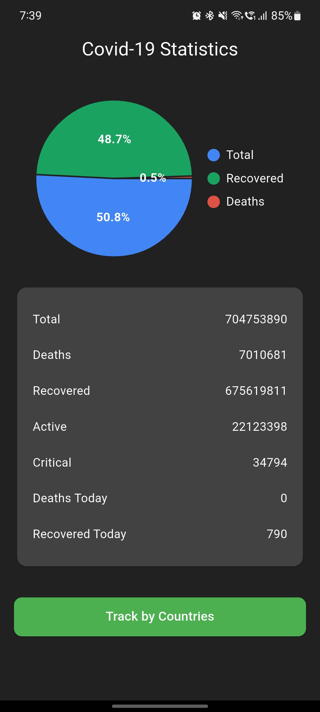
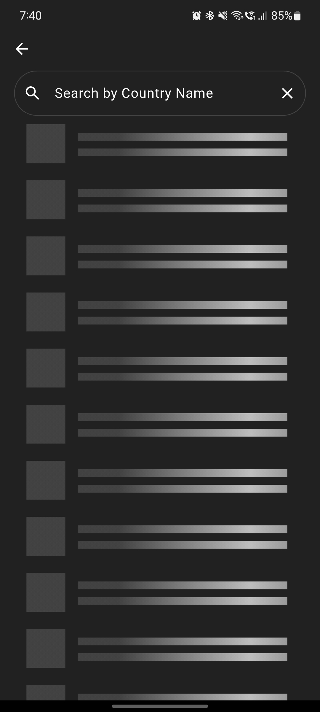
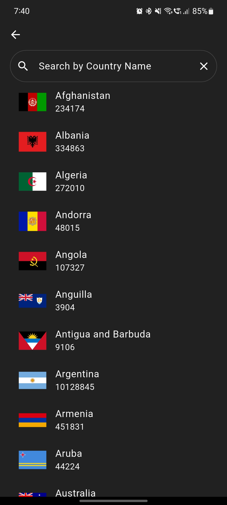
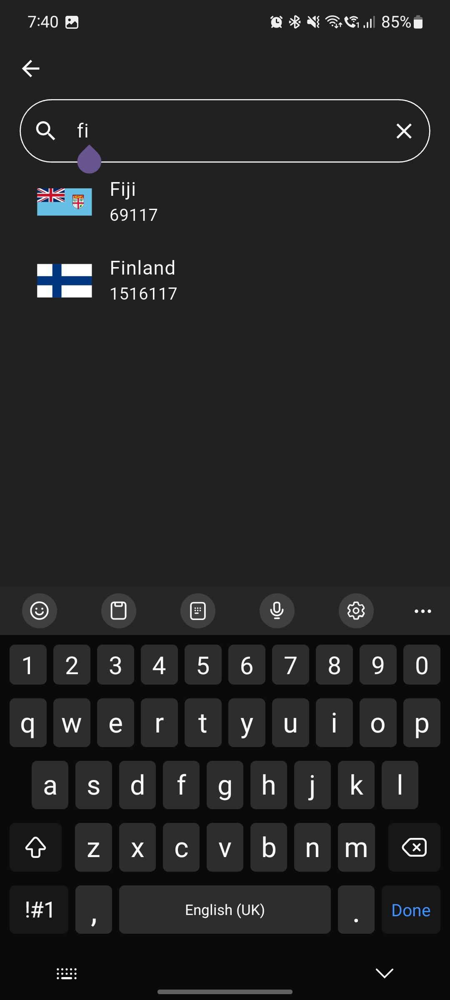
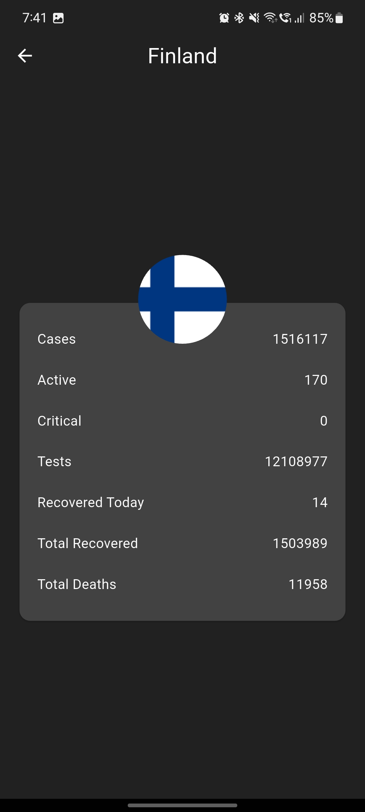

# 🦠 COVID-19 Tracker App  

A modern and responsive **COVID-19 Tracker Application** built with **Flutter**, providing real-time global and country-wise statistics using a public API.  
The app visualizes worldwide COVID-19 data with charts, displays detailed country statistics, and includes search functionality for quick access.  

---

## Features 🚀  

- **Splash Screen** 🎬  
  - Animated rotating virus logo.  
  - Smooth transition into the main dashboard.  

- **Global Statistics** 🌍  
  - Fetch real-time worldwide COVID-19 stats.  
  - Displayed with an interactive **Pie Chart**.  
  - Detailed breakdown: total cases, active, recovered, deaths, today’s updates, and more.  

- **Country-wise Tracking** 🗺️  
  - Browse stats for all affected countries.  
  - Country list with flags, total cases, and deaths.  
  - Tap any country for a **detailed view** (active, critical, tests, recoveries, deaths).  

- **Search Functionality** 🔍  
  - Search countries by name in real-time.  
  - Clear search with one tap.  

- **Loading Shimmers** ✨  
  - Shimmer effect while fetching data.  
  - Smooth user experience during API calls.  

- **Clean UI / Dark Theme** 🎨  
  - Consistent dark-themed design with custom colors.  
  - Easy-to-read typography and responsive layout.  

---

## 📸 Screenshots  

### **Splash Screen**  


### **World Statistics (Pie Chart + Global Data)**  


### **Countries List with Search**  
<p>



</p>  

### **Country Detail Screen**  
<p>

</p>  

---

## Dependencies 📦  

This project uses the following dependencies:  

- [`http`](https://pub.dev/packages/http) – Fetch world & country statistics via API.  
- [`flutter_spinkit`](https://pub.dev/packages/flutter_spinkit) – Loading animations.  
- [`shimmer`](https://pub.dev/packages/shimmer) – Shimmer effect for loading placeholders.  
- [`fl_chart`](https://pub.dev/packages/fl_chart) – To visualize stats in chart format.  

---

## Tech Stack 🛠️  

- **Flutter** – Cross-platform mobile app framework.  
- **Dart** – Programming language.  
- **Public COVID-19 API** – Provides real-time stats.  
- **VS Code / Android Studio** – IDEs for development.  
- **Git** – Version control.  

---

## Setup Instructions ⚙️

### Clone and Run
```bash
git clone https://github.com/muhammadXainAhmad/covid19_tracker_flutter
cd covid19_tracker_flutter
flutter pub get
flutter run
```

---

## License 📄
This project is licensed under the [MIT License](LICENSE).
